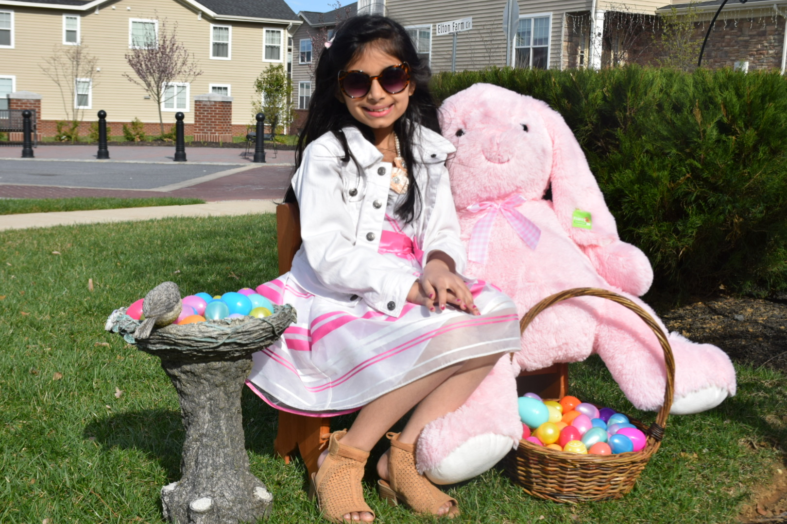
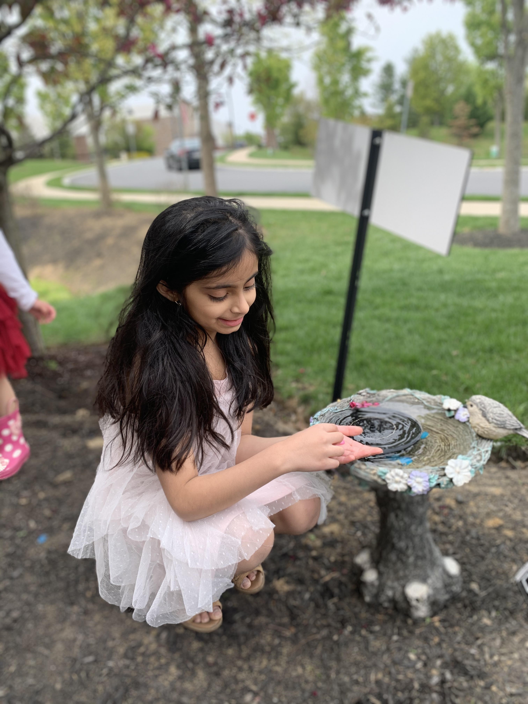
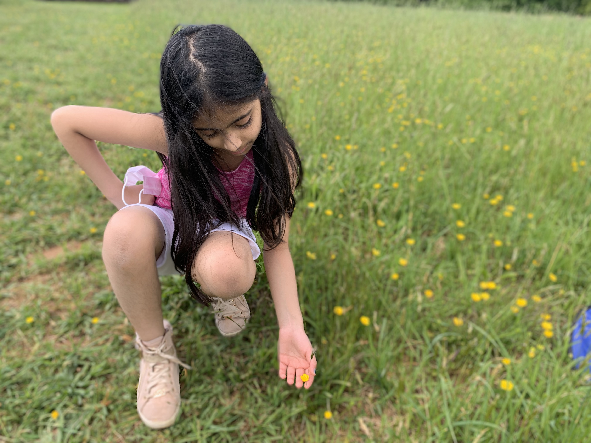

# Spring
### By: Aditi Jadhav

In spring, animals start arousing out of hibernation, the weather also changes, trees and flowers bloom, and uncoil. Eyelids leisurely open, as bees buzz, bunnies hop, and butterflies flutter. We pull on our impermeable jackets, and carry our repellant for the rain, the umbrellas. Everybody is everywhere, kites soaring, hikers wandering, swimmers swimming. Everything and everyone is springing with life.

When spring comes, intricate and elegant flowers unravel gently, very prettily. Naked trees prickle with life as leaves blossom on trees and open their chests wide, proudly greeting the world. Awakening from their deep sleeps, animals are sighing in relief that winter has ended. They are now running around having a joyful time with their cute, newborn babies. As they start munching on new, fresh food they fill themselves up with energy. They are now flooding with satisfaction and pleasure.



When spring begins, the weather changes. The freezy, icy, white snow thaws away slowly, and carefully. The sun pinnacles out warming our beautiful earth, waving to us brightly, brilliantly. The chilly temperature now varies, to a comfy, mellow warmth the sun brings. As the sayings come true, clouds surround the sky, and tiny droplets prickle onto the soft, spiky ground, Drip, Drop. Everybody is cheerful and exuberant as days get longer.

In spring, activities are flying in the air. Kites soar like planes through the sky, or kayaks move through the coruscating water. You might take a dip in the pool, SPLASH! The cool, relaxing, defiant water rubs against your skin. Beaches are filled with crowds of people, sand castles escalate from the powdery surface and surf boards glide against the salty ocean water. 

Spring is paradise, it's a time to awaken, above is bright and blue, spring is filled with things to do. Precious crocuses, daffodils, dwarf irises, and forsythias flourish and sprout. Sometimes it rains cats and dogs, but other times it is so hot you might melt. No matter what the weather is, there is always some activity to attend. By far spring is the most splendiferous time of year.
